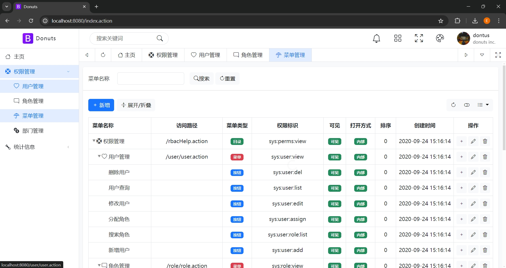
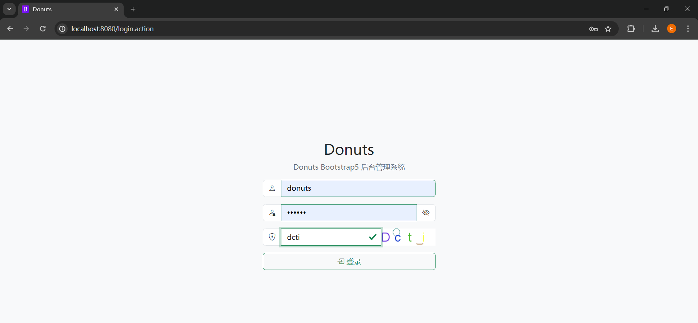
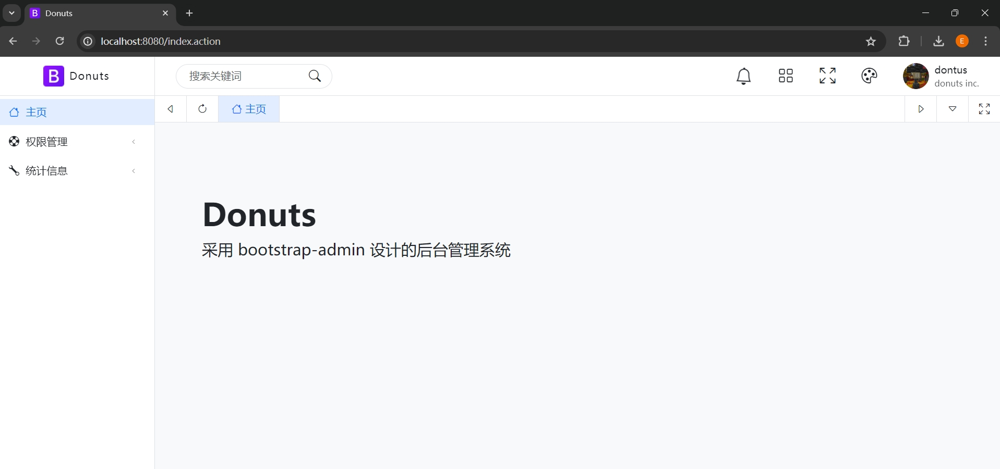
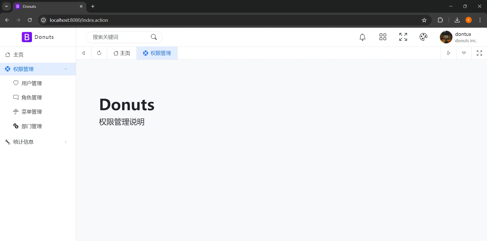
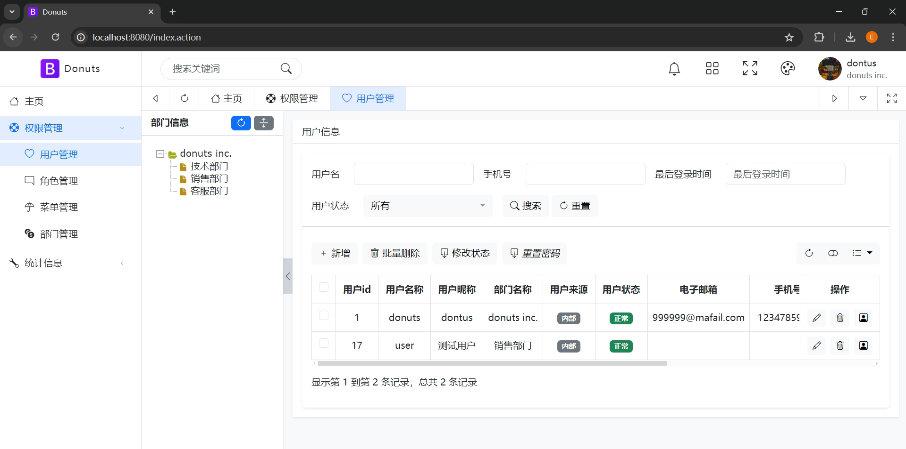
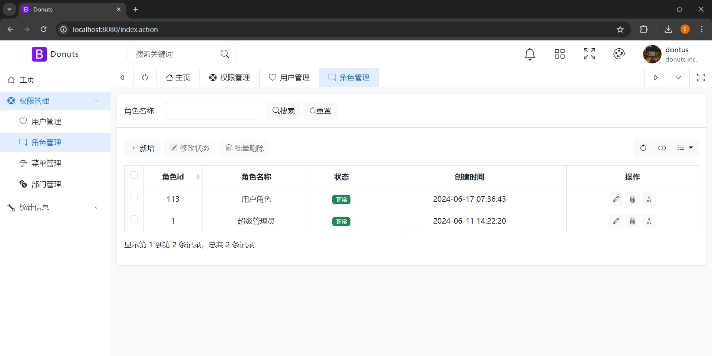
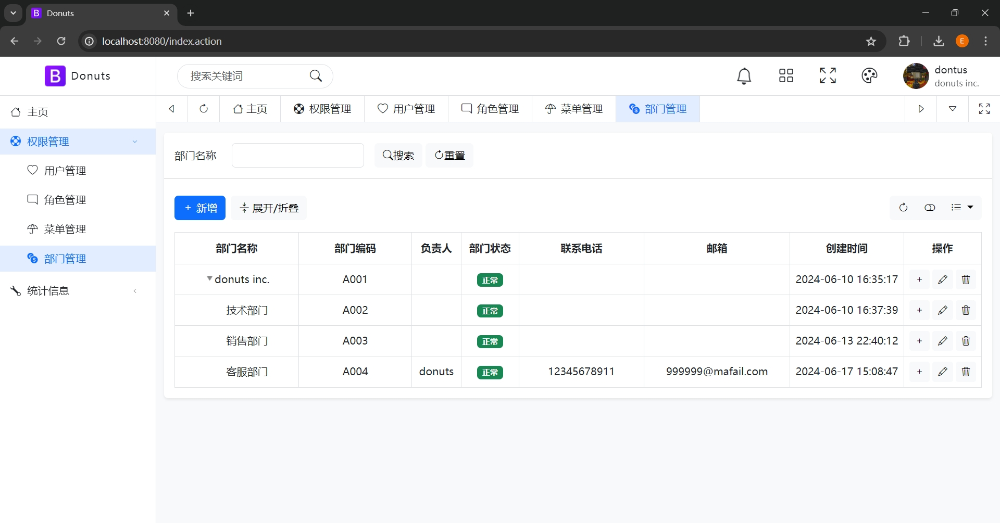
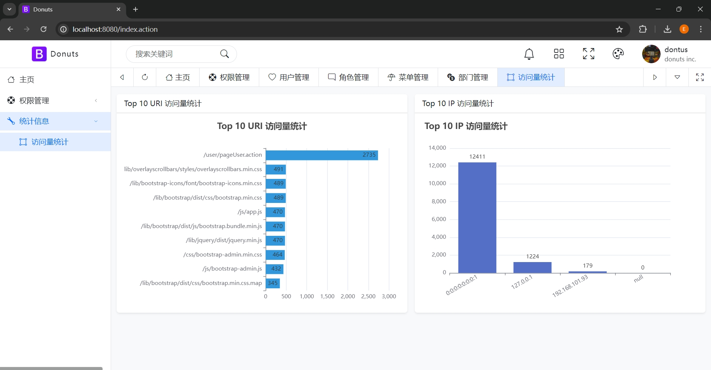

# Donuts 
前端采用 bootstrap-admin 做的一套后台管理系统

[点击访问 bootstrap-admin 前端模板官网](https://gitee.com/ajiho/bootstrap-admin)

简洁化 开箱即用 目前只用到了mysql.

`spring boot 3.2.6`
`java22+`
`gradle`
`mysql`

### 说明
No.1 导入数据库文件 `doc/sql/sql.sql`

No.2 支持目录点击

No.3 支持国际化(目前翻译尚未完善)

No.4 支持权限拦截

请配置文件上传路径,不然头像显示不出来

### 当前版本
`0.0.1-SNAPSHOT`

### 账号/密码
donuts/123456 管理员

user/123456 模拟普通用户

### Swagger地址

http://localhost:8080/doc.html

### 预览

